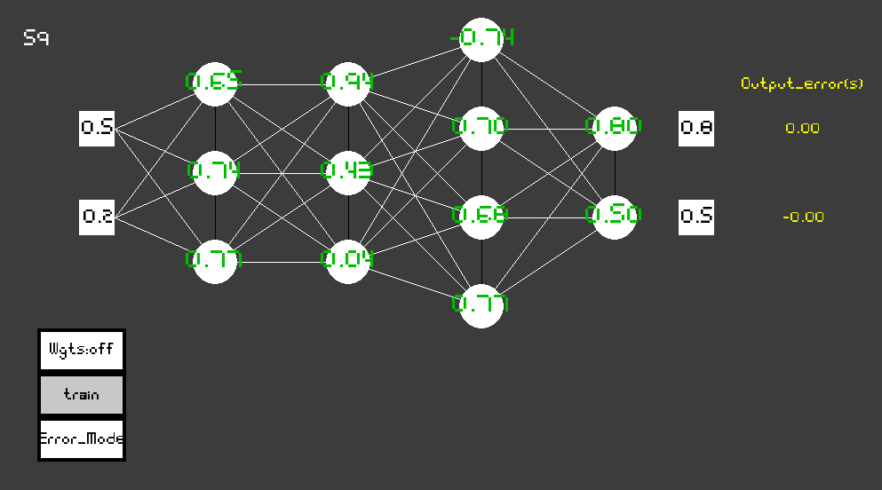

# Neural Network Visualization
### I promised to myself that I will practice with NNs until I understand at least the basic concept to its fullest, and what is the better way to understand it then trying to visualyze the thing? So here is my a bit crappy NN visualization (kinda a squel to my Flappy Bird).  [video references ](https://www.youtube.com/watch?v=XJ7HLz9VYz0&list=PLRqwX-V7Uu6aCibgK1PTWWu9by6XFdCfh).

*       there the shape of the Neural_Network class instance can be tweaked (first num - how many layers, and then in the tuple their dimentions have to be defined, then goes position on the screen and unmber of inputs(by default it is number of neurons in the first layer))

*       this is how current configuration looks like

*       you can also kinda see the current weights but I did not fiddle to much with it so some of them overlap other ones (Is activated by liking Whts:on/off button)

*       Also you can see how errors are distributed throught the entire Network by clicking (Error_Mode) Button

*       Lastly just change inputs and expected values (these are squres), by clicking them and inputing new values via a keyboard, and click (train) button, you will see how everything get adjusted according to your values

